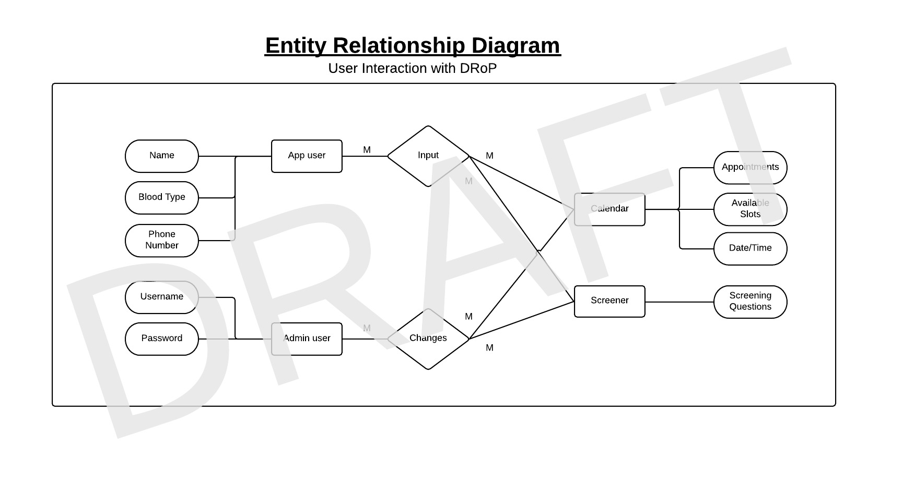
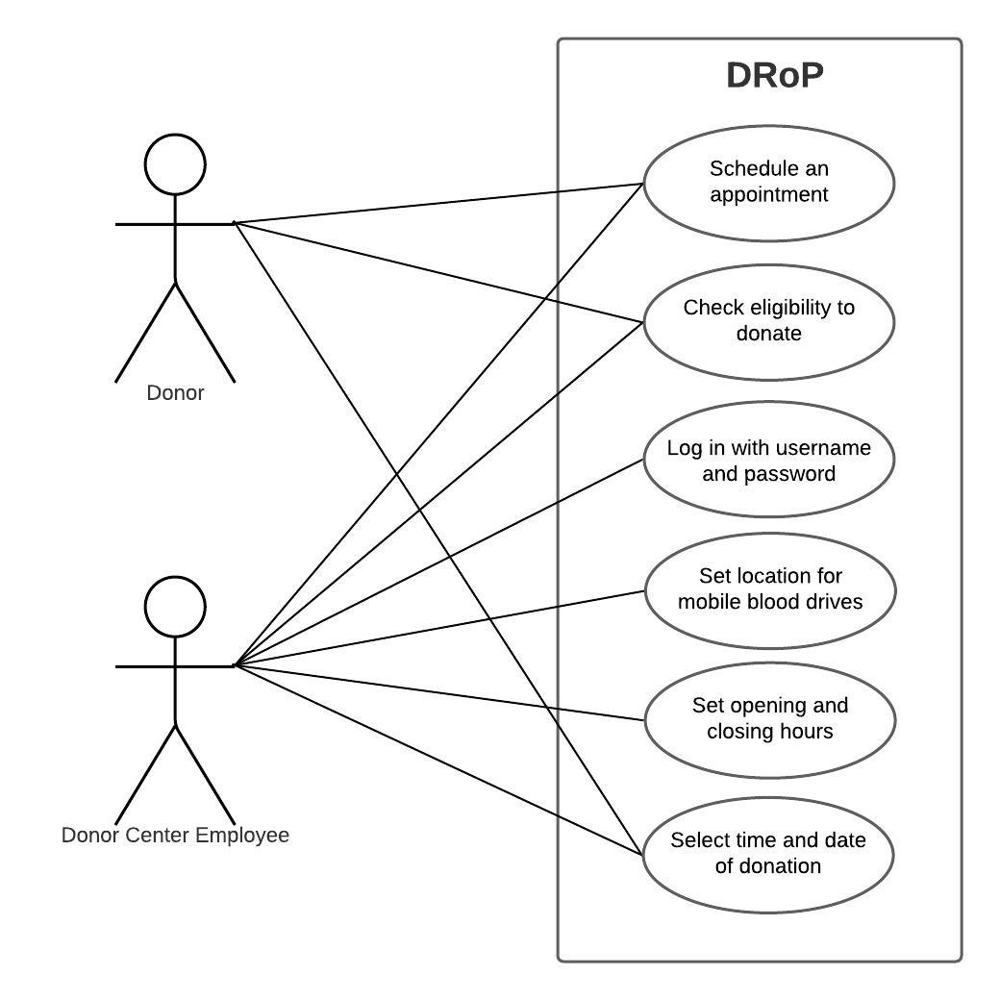

# DRoP
> This is a project with the MSSA and is currently in progress as I learn of the process of developing a web application.
> 
DRoP (Donor Repository Platform) is an ASP.NET web application that schedules appointments and screens potential blood donors for eligibility.

## Table of Contents
  * [I. Entity-Relationship Diagram](#i-entity-relationship-diagram)
  * [II. Wireframe sketches](#ii-wireframe-sketches)
    + [Home page](#home-page)
    + [Schedule your appointment page](#schedule-your-appointment-page)
    + [Screening page](#screening-page)
    + [Contact us page](#contact-us-page)
  * [III. User Stories](#iii-user-stories)
  * [IV. Use Cases](#iv-use-cases)
  * [V. Use-Case Diagram](#v-use-case-diagram)
  * [VI. Requirements](#vi-requirements)
    + [User Requirements](#a-user-requirements)
    + [Test Planning](#b-test-planning)
    + [Test Table](#c-test-table)
    + [System Requirements](#d-system-requirements)
    + [Software requirements](#e-software-requirements)
  * [VII. Protype](#vii-prototype)
  * [VIII. Database Diagram](#viii-database-diagram)
  * [IX. Database Integration](#ix-database-integration)

## I. Entity-Relationship Diagram

> need to add gender under app user

[Back to top](#table-of-contents)

## II. Wireframe sketches

### Home page

[Back to top](#table-of-contents)

### Schedule your appointment page

[Back to top](#table-of-contents)

### Screening page

[Back to top](#table-of-contents)

### Contact us page

[Back to top](#table-of-contents)

## III. User Stories

1. As a blood donor, I want to schedule my appointments online so that I don't have to wait in line.
2. As a blood donor, I want to be able to check if I'm qualified to donate online so that I don't have to waste my time driving to the donation center.
3. As a blood donor center, I want donor to be able to make their appointments and check their eligibility with ease so that they come more frequently.
4. As a blood donor center, I need to be able to collect as much blood as possible so that no one will have to lose their lives because of not having enough blood.
5. As a blood donor center, I want to know how many donors will be coming every day so that I manage my expectations or recruit more people.

[Back to top](#table-of-contents)

## IV. Use Cases

1. Given a user, when the user wants to schedule an appointment, then they have to input their full name, phone number, and blood type
2. Given a user, when the user does not completely fill out their details, then they will not be able to schedule their appointment.
3. Given a user, when the user wants to check if they are qualified to donate, they have to answer a set of questions.
4. Given a user, when the user does not want to or do not have the time to fill out the questionnaire, then they will have to fill our the questionnaires once they get to the donation center.
5. Given a user, when he/she answers the qualifying set of questions and does not qualify, then the user does not have to proceed with scheduling their appointment.
6. Given the blood donor center, when a potential donor who is able to schedule an appointment with the applications, then the blood donor center employees will be able to see who it is by logging onto the web application.
7. Given a holiday, weekend, or any unforseen reason to close, when the blood donor center is closed, then the blood donor center employees will be able to set and change the open and closing hours.
8. Given a mobile blood drive, when users want to schedule an appointment at that location, then the user can choose at which location they would want to donate.

[Back to top](#table-of-contents)

## V. Use-Case Diagram

[Back to top](#table-of-contents)
   
## VI. Requirements

### A. User Requirements
1. Admin
    + Log in capabilities.
    + User can reset their passwords.
    + Given a blood drive, set its location, time, and date.
    + Set the number of available slots per period (15 minutes, 30 minutes, 1 hour, etc.)
    
2. User
    + No log in capability to reduce risk of health information violation
    + After selecting a date and location, users are able to choose an available timeslot, place their name, phone number, and blood type, and save it to the calendar/database.
    + Users will have the option to answer the questionnaire that qualifies them for blood donation eligibility.

[Back to top](#table-of-contents)

### B. Test Planning
| ReqID | Requirement Description | Test Method | TestID |
| -------------- | ----------------------- | ----------- | ------ | 
| 1.0 | All pages display their contents correctly (Home page, scheduling page, screening page, and contact us page) | Inspection | 100 |
| 1.1 | All questions for screening only display the necessary information | Inspection | 101 |
| 2.1 | Employees are able to set a new password | Demonstration | 200 |
| 2.2 | Employees are able to log in given a valid user/password combination | Demonstration | 201 |
| 2.3 | Employees are able to set a location, date, and hours of a blood drive | Demonstration | 202 |
| 2.4 | Donors are able to select a date and set an appointment for a specific time | Demonstration | 203 | 
| 2.5 | Donors are able to self-screen and check for dontaion eligibility | Demonstration | 204 |
| 3.0 | Given a valid user/password, the system lets the employee log in | Test | 201 | 
| 3.1 | Given an invalid user/password, the system does not let the employee log in | Test | 202 |
| 3.2 | Donors are able to select a date and time, and set an appointment for a specified time | Test | 203 | 
| 3.3 | Donors are not able to select filled timeslots and days which are specified as taken, or closed (i.e. weekends, holidays, etc.) | Test | 203 |
| 3.4 | Eligible donors who answer questions correctly will have 'eligible' displayed after the last question | Test | 300 |
| 3.5 | Ineligible donors will have 'ineligible' and the reason for ineligibility displayed after the last question | Test | 301 |

[Back to top](#table-of-contents)

### C. Test Table
| TestID | ReqID | Test Procedure | Current Status | TimeStamp |
| -------| ----- | -------------- | -------------- | --------- | 
| 100 | 1.0 | Verify that each page contains every content (image, calendars, buttons, etc.) | Not Tested |  |
| 101 | 1.1 | Scroll through every screening question and verify that all are present. | Not Tested |  |
| 201 | 2.1, 3.0 | Verify that old passwords do not allow employees to log in once changed | Not Tested |  |
| 202 | 2.2, 3.2 | Verify that users are able to log in with valid user/password combinations | Not Tested |  |
| 203 | 2.3, 3.2, 3.3 | Ensure that created blood drives appear in the calendar/schedule donation page | Not Tested |  |
| 204 | 2.4 | Verify that donors are able to select a time, occupies, and disables that specific timeslot | Not Tested |  | 
| 205 | 2.5 | Donors are able to self-screen and check for dontaion eligibility | Not Tested |  |
| 300 | 3.4 | Eligible donors who answer questions correctly will have 'eligible' displayed after the last question | Not Tested |  |
| 301 | 3.5 | Ineligible donors will have 'ineligible' and the reason for ineligibility displayed after the last question | Not Tested |  |

[Back to top](#table-of-contents)

### D. System Requirements
| Component | Minimum | Recommended |
| --------- | ------- | ----------- |
| Processor | 1.9 gigahertz (GHz) x86- or x64-bit dual-core processor with SSE2 instruction set | 3.3 gigahertz (GHz) or faster 64-bit dual-core processor with SSE2 instruction set
| Memory | 2-GB RAM | 4-GB RAM or more |
| Display | Super VGA with a resolution of 1024 x 768 | Super VGA with a resolution of 1024 x 768 |

[Back to top](#table-of-contents)

### E. Software requirements
1. Host/Client: Any machine that can access a webpage with a browser
2. Development: Visual Studio, C# language, T-SQL, ASP.NET, Git, Azure

[Back to top](#table-of-contents)

## VII. Prototype

Check it out by clicking --> [here!](https://xd.adobe.com/view/b405d513-1ec9-4ccc-a51d-c37fbc12acf1-e156/)

[Back to top](#table-of-contents)

## VIII. Database Diagram

[Back to top](#table-of-contents)

## IX. Database Integration

Shows the question table with no entries in SSMS.

As well as in the DonorQuestions/Index

Adding a question using the Create in the webApp

Clicked Create, and now shows in the DonorQuestions/Index

As well as in SSMS

[Back to top](#table-of-contents)
