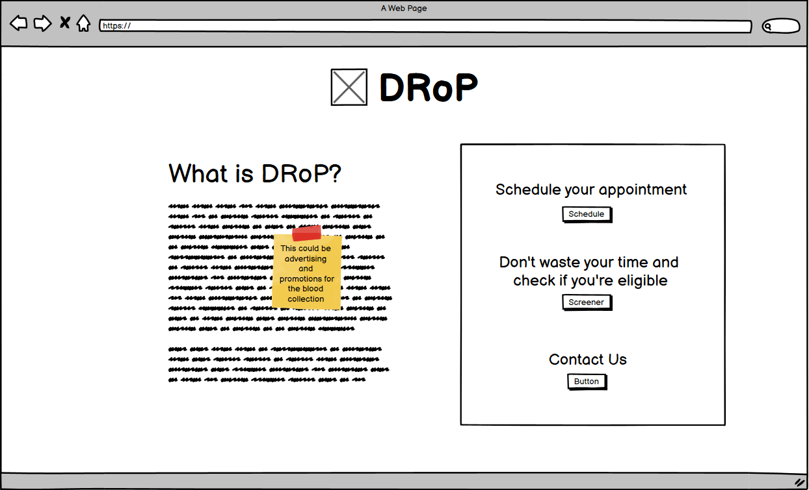
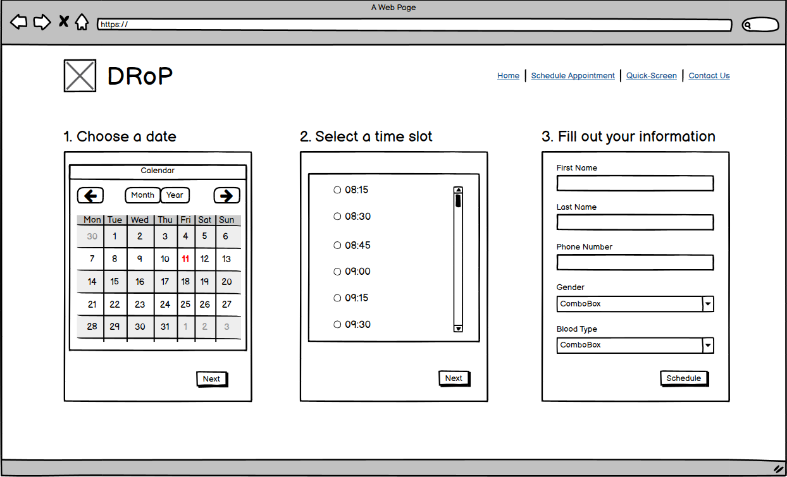
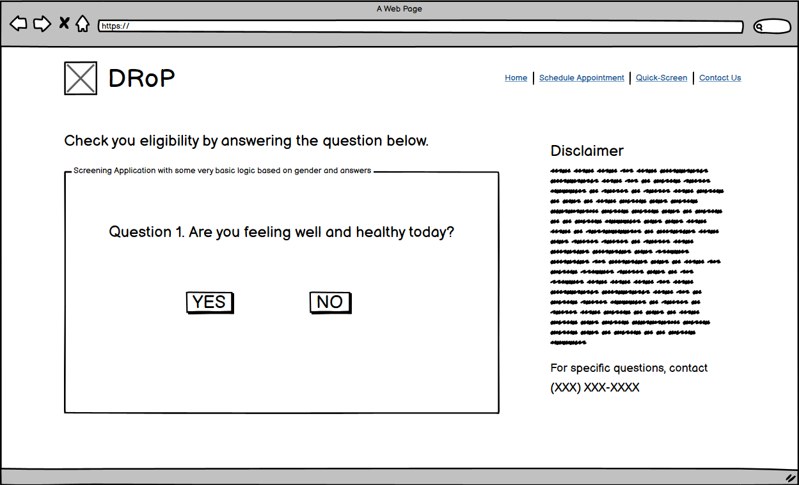
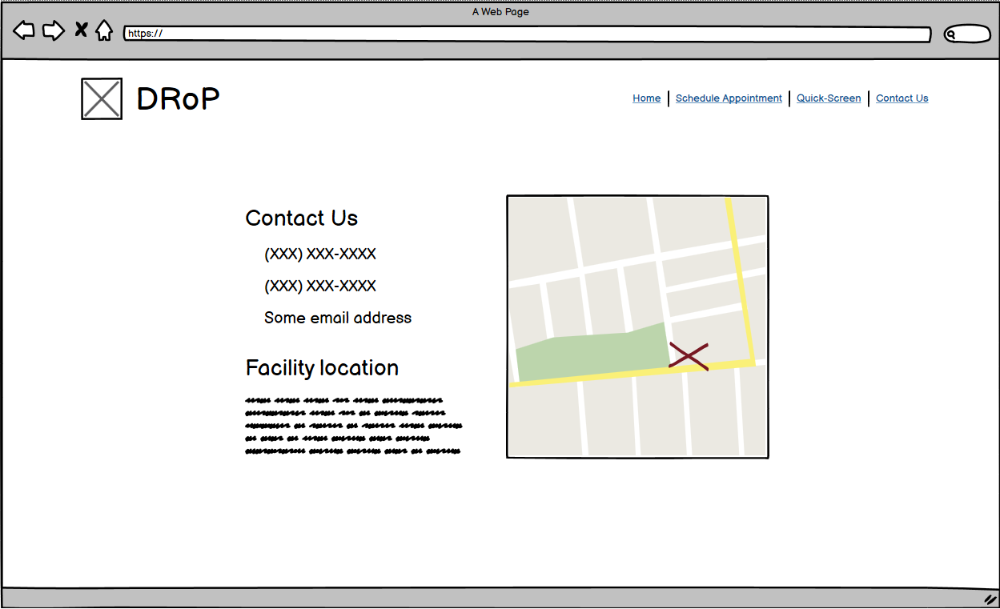

# DRoP
DRoP (Donor Repository Platform) is an ASP.NET web application that schedules appointments and screens potential blood donors

## Table of Contents
  * [I. Wireframe sketches](#i-wireframe-sketches)
    + [Home page](#home-page)
    + [Schedule your appointment page](#schedule-your-appointment-page)
    + [Screening page](#screening-page)
    + [Contact us page](#contact-us-page)
  * [II. User Stories](#ii-user-stories)
  * [III. Use Cases](#iii-use-cases)
  * [IV. Use-Case Diagram](#iv-use-case-diagram)
  * [V. Requirements](#v-requirements)
    + [A. User Requirements](#a-user-requirements)
    + [B. System Requirements](#b-system-requirements)
    + [C. Software requirements](#c-software-requirements)

## I. Wireframe sketches

### Home page

[Back to top](#table-of-contents)

### Schedule your appointment page

[Back to top](#table-of-contents)

### Screening page

[Back to top](#table-of-contents)

### Contact us page

[Back to top](#table-of-contents)

## II. User Stories

1. As a blood donor, I want to schedule my appointments online so that I don't have to wait in line.
2. As a blood donor, I want to be able to check if I'm qualified to donate online so that I don't have to waste my time driving to the donation center.
3. As a blood donor center, I want donor to be able to make their appointments and check their eligibility with ease so that they come more frequently.
4. As a blood donor center, I need to be able to collect as much blood as possible so that no one will have to lose their lives because of not having enough blood.
5. As a blood donor center, I want to know how many donors will be coming every day so that I manage my expectations or recruit more people.
[Back to top](#table-of-contents)

## III. Use Cases

1. Given a user, when the user wants to schedule an appointment, then they have to input their full name, phone number, and blood type
2. Given a user, when the user does not completely fill out their details, then they will not be able to schedule their appointment.
3. Given a user, when the user wants to check if they are qualified to donate, they have to answer a set of questions.
4. Given a user, when the user does not want to or do not have the time to fill out the questionnaire, then they will have to fill our the questionnaires once they get to the donation center.
5. Given a user, when he/she answers the qualifying set of questions and does not qualify, then the user does not have to proceed with scheduling their appointment.
6. Given the blood donor center, when a potential donor who is able to schedule an appointment with the applications, then the blood donor center employees will be able to see who it is by logging onto the web application.
7. Given a holiday, weekend, or any unforseen reason to close, when the blood donor center is closed, then the blood donor center employees will be able to set and change the open and closing hours.
8. Given a mobile blood drive, when users want to schedule an appointment at that location, then the user can choose at which location they would want to donate.
[Back to top](#table-of-contents)

## IV. Use-Case Diagram

[Back to top](#table-of-contents)
   
## V. Requirements

### A. User Requirements
1. Blood Donor Center Employee
  * Log in capabilities.
  * User can reset.
  * Given a mobile blood drive, set a location, time, and date of the blood drive.
  * Set the number of available slots per period (15 minutes, 30 minutes, 1 hour, etc.)
[Back to top](#table-of-contents)
    
2. User/Blood Donor
  * No log in capability to reduce risk of health information violation
  * After selecting a date and location, users are able to choose an available timeslot, place their name, phone number, and blood type, and save it to the calendar/database.
  * Users will have the option to answer the questionnaire that qualifies them for blood donation eligibility.
[Back to top](#table-of-contents)

### B. System Requirements
| Component | Minimum | Recommended |
| --------- | ------- | ----------- |
| Processor | 1.9 gigahertz (GHz) x86- or x64-bit dual-core processor with SSE2 instruction set | 3.3 gigahertz (GHz) or faster 64-bit dual-core processor with SSE2 instruction set
| Memory | 2-GB RAM | 4-GB RAM or more |
| Display | Super VGA with a resolution of 1024 x 768 | Super VGA with a resolution of 1024 x 768 |
[Back to top](#table-of-contents)

### C. Software requirements
1. Host/Client: Any machine that can access a webpage with a browser
2. Development: Visual Studio, C# language, T-SQL, ASP.NET, Git, Azure
[Back to top](#table-of-contents)
